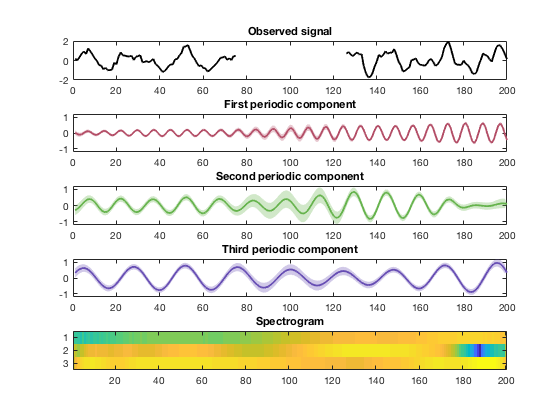

## Demo code for inference in Gaussian process time-frequency analysis / spectral mixture models, in both the kernel-based and stochastic differential equation (SDE) forms.

This is code I wrote for a seminar I gave on probabilistic models for time-frequency analysis. It contains toy examples of the traditional kernel-based inference in Gaussian process spectral mixture models, and the corresponding SDE approach, which gives the identical solution in linear time scaling.

This is essentially the code I wish someone had given me at the start of my PhD, so I hope it comes in useful to someone else trying to get heir head around Gaussian process models for signal processing.

I don't do any hyperparameter learning here, for a more complete set of tools see our [paper](https://arxiv.org/abs/1811.02489) and [full code](https://github.com/wil-j-wil/unifying-prob-time-freq).

This is the result when running `tf_posterior.m`, it takes a signal with a missing segment, and infers the 3 latent quasi-periodic components that sum to produce the signal (including in the gap):

